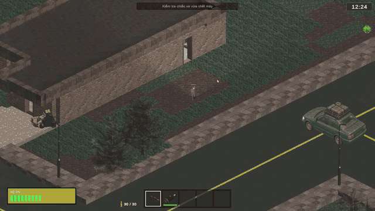
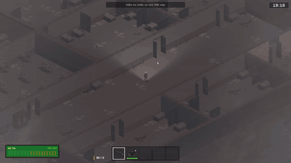
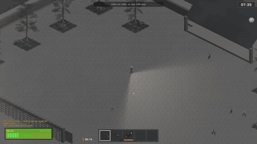

<div align="center">

# FRAGMENTS OF SURVIVAL

**Explore the dark. Scavenge what remains. Survive the encounter.**

A student-built isometric zombie survival game, made with Unity and C#.


[Gameplay](#gameplay-in-motion) · [Systems](#under-the-hood) · [Run the project](#run-the-project) · [Demo build](#demo-build)



*Recorded gameplay: moving from the street into a house.*

</div>

## The game

Explore streets, houses, and a hospital from an isometric perspective. Search for supplies, follow objectives, and respond to pursuing zombies while navigating areas with limited visibility.

The project brings together **solo play**, **Photon Fusion Host Mode multiplayer**, **survival systems**, and **local lighting and visibility**. Development and playtesting are ongoing; the footage below demonstrates selected gameplay rather than a finished release.

## Gameplay in motion

### 01 — Crossing into the dark

The opening clip shows the player entering the first house. Interior visibility updates with movement, keeping the surrounding darkness part of exploration in a 2D environment.

<table>
<tr>
<td width="50%" valign="top">
<h3>02 — Hospital exploration</h3>

<p>A continuous walk through the hospital: room layout, local illumination, and surrounding darkness shape the route through the interior.</p>
</td>
<td width="50%" valign="top">
<h3>03 — Combat & positioning</h3>

<p>Reposition around pursuing enemies, aim attacks, and read combat feedback while the directional flashlight limits what is visible.</p>
</td>
</tr>
</table>

## Under the hood

| Area | Implementation focus |
| :--- | :--- |
| **World presentation** | Indoor fog, directional lighting, player visibility, and client-local presentation. |
| **Zombie AI** | A* navigation, pursuit, obstacle handling, and recovery around constrained geometry. |
| **Survival & objectives** | Inventory and loot, player checkpoints, quest progression, and siege rules. |
| **Multiplayer** | Photon Fusion 2 Host Mode, authority-owned gameplay state, RPC validation, and late-join reconciliation. |
| **Verification** | Focused Unity Editor and PlayMode regression tests alongside playable Windows builds. |

These are implemented project areas, not a claim that every scenario has completed multiplayer or release QA.

## Run the project

### Requirements

- **Unity Hub** and **Unity Editor 6000.0.69f1** (the version recorded in this repository).
- Git and access to the project's package dependencies.
- A suitable Photon Fusion application configuration when testing online multiplayer.

### Open in Unity

1. Clone this repository:

   ```bash
   git clone https://github.com/KhoaCodeBug/DuAnTotNghiep.git
   ```

2. In Unity Hub, choose **Add project from disk** and select the cloned folder containing `Assets`, `Packages`, and `ProjectSettings`.
3. Open it with **6000.0.69f1** and let Unity finish importing assets and resolving packages.
4. Open [`Assets/Scenes/MainMenu.unity`](Assets/Scenes/MainMenu.unity), then enter Play Mode and use the menu to start.
5. For multiplayer, review the project's Photon application settings and use your own valid configuration. Test Host and Client behavior separately from Solo.

The enabled build scenes are `MainMenu`, `Main`, and `Intro_Cinematic`. Start from the menu so the normal loading and player setup flow runs.

<details>
<summary><strong>Repository map</strong></summary>

| Folder | Contents |
| :--- | :--- |
| [`Assets/Scenes`](Assets/Scenes) | Menu, gameplay, cinematic, and development scenes. |
| [`Assets/Script`](Assets/Script) | Gameplay scripts and related systems. |
| [`Assets/Photon`](Assets/Photon) | Photon networking integrations. |
| [`Packages`](Packages) | Unity package manifest and lockfile. |
| [`ProjectSettings`](ProjectSettings) | Editor version, build scenes, and project configuration. |
| [`Documentation/UML`](Documentation/UML) | Project diagrams. |

</details>

## Demo build

**A downloadable demo is not linked yet.** The gameplay clips above are available now; a Windows build can be added after its release candidate has been selected and playtested.

When published, demo downloads will be listed under [GitHub Releases](https://github.com/KhoaCodeBug/DuAnTotNghiep/releases), with version notes and known issues. Download the complete ZIP and extract all files together; the executable depends on its accompanying data and runtime files.

## Team & feedback

Built as a collaborative graduation project. See the [contributor history](https://github.com/KhoaCodeBug/DuAnTotNghiep/graphs/contributors) for the people behind the work.

Found an issue? [Open a report](https://github.com/KhoaCodeBug/DuAnTotNghiep/issues) with the game version or commit, Solo/Host/Client mode, reproduction steps, expected and actual behavior, and a screenshot or short recording when useful.

---

<div align="center">
<strong>Fragments of Survival</strong><br/>
Unity · C# · Isometric survival · Work in progress
</div>
